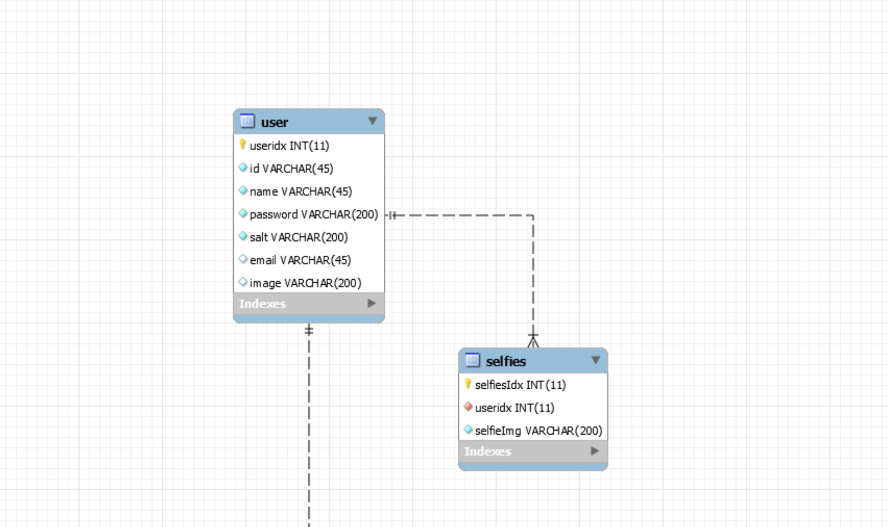

# LEVEL 3 ✨

## ERD ✨

## API TEST ✨

### 1. 로그인해서 token 값 가져오기

#### token 값 헤더에 복사

### 2. 이미지 여러 개 저장

#### 한 번 더 ~ (값 변하는 것 확인 가능)

### +) 저장된 전체 이미지 user별로 조회

### TERMINAL LOG ✨

#### 어렵지만 재밌다,,,,,,, 진심이다.,,,,,,,,,,
